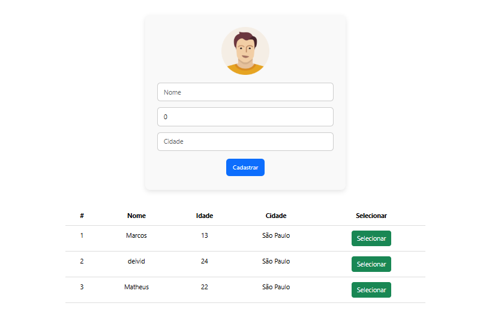
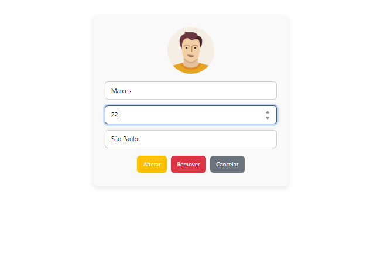

# API REST com Spring Boot e Angular

Aplicação CRUD Angular + Spring com diversas fucionalidades.

## 💻 Tecnologias
- Java 21

- Spring Boot 3 (Spring 6)

- Maven

- JPA + Hibernate

- MySQL

- Angular v18


## ⌨️ Editor / IDE
- Visual Studio Code

- [Java Extensions](https://marketplace.visualstudio.com/items?itemName=loiane.java-spring-extension-pack)

- [Angular Extensions](https://marketplace.visualstudio.com/items?itemName=loiane.angular-extension-pack)

## Funcionalidades
- ✅ Cadastrar clientes

- ✅ Listar todos os clientes

- ✅ Editar dados do cliente

- ✅ Remover cliente

- ✅ Selecionar cliente para edição

- ✅ Design responsivo básico com Bootstrap


## Capturas de tela
Página principal



Detalhes dos clientes para edição




## 🔧 Como Rodar o Projeto
### Executando o Back-end
Você precisa ter o Java e o Maven instalados e configurados localmente.

Abra o crud-spring projeto no seu IDE favorito como um projeto Maven e execute-o como um aplicativo Spring Boot.


### Executando o Front-end
1. Clone o repositório.

2. Vá para a pasta do front-end:
``` bash
cd crud-angular
```

3. Instale as dependências:
``` bash
npm install
```

4. Inicie a aplicação Angular:
``` bash
ng serve
```

Este comando executará o projeto Angular com um proxy para o servidor Java, sem exigir CORS.

Abra seu navegador e acesse http://localhost:4200 (porta padrão do Angular).


## 📌 Observações

- Este projeto está com a url do banco de dados MySQL no arquivo do back src/main/resources/application.properties;

- Crie uma base de dados chamada (courses), para que ao rodar a versão do back, as tabelas sejam criadas dentro do schema;

- Projeto ideal para fins didáticos, portfólios ou bases para sistemas maiores;

## Licença
Curso do projeto disponibilizado e ensinado no canal de youtube do professor Ralf Lima.

- [Youtube - Ralf Lima](https://www.youtube.com/@RalfLima)

